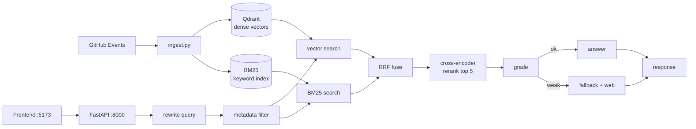

# Sleuth

Live incident-response RAG. It polls GitHub’s public Events API, indexes each event in Qdrant + BM25, and answers investigation queries through a LangGraph pipeline (rewrite → hybrid retrieve → grade → answer or web fallback → mock tool pick) with input/output guardrails.

## Data sources


| Source                                             | What it is                                                                                              | Auth                                                      |
| -------------------------------------------------- | ------------------------------------------------------------------------------------------------------- | --------------------------------------------------------- |
| [GitHub Events API](https://api.github.com/events) | Public timeline (pushes, issues, PRs, workflow runs, …) polled every few seconds by `backend/ingest.py` | None required; optional `GITHUB_TOKEN` raises rate limits |
| OpenAI                                             | Embeddings (`text-embedding-3-small`) + `gpt-4o-mini` for grading, answers, tools, guardrails           | `OPENAI_API_KEY` in `.env`                                |
| DuckDuckGo (`ddgs`)                                | Web search when the grader marks local logs as weak (fallback path)                                     | No key                                                    |


Ingest pulls real public GitHub events while the API runs; the corkboard event counter reflects what has been indexed.

## Quick start

```bash
cp .env.example .env          # set OPENAI_API_KEY

cd backend
python3 -m venv .venv && source .venv/bin/activate
pip install -r requirements.txt
python -m uvicorn main:app --reload --port 8000

# other terminal
cd frontend
npm install
npm run dev
```


| URL                                            | Service                                    |
| ---------------------------------------------- | ------------------------------------------ |
| [http://127.0.0.1:5173](http://127.0.0.1:5173) | Frontend — Vite React corkboard UI         |
| [http://127.0.0.1:8000](http://127.0.0.1:8000) | Backend — FastAPI (`/incident`, `/stream`) |


Open **5173** in a browser. The frontend proxies `/incident` and `/stream` to port 8000 (`frontend/vite.config.js`).

## Architecture



| File                    | Role                                                                               |
| ----------------------- | ---------------------------------------------------------------------------------- |
| `backend/ingest.py`     | Poll, flatten, embed, BM25; hybrid search + metadata filter + cross-encoder rerank |
| `backend/agent.py`      | LangGraph: rewrite → retrieve → grade → answer/fallback → tool                     |
| `backend/tools.py`      | Mock ops tools + structured selection (log only, no real infra)                    |
| `backend/guardrails.py` | Input / output checks                                                              |
| `backend/main.py`       | `POST /incident`, `GET /stream/status`                                             |
| `frontend/`             | Corkboard UI                                                                       |


Retrieval is dense cosine + BM25 fused with RRF, optional payload filters when a single repo/event type is clear, then `cross-encoder/ms-marco-MiniLM-L-6-v2` reranks the top ~15 down to 5.

## API

`POST /incident`

```json
{ "query": "Any WorkflowRun failures showing up in recent logs?" }
```

```json
{
  "answer": "...",
  "path_taken": "direct | fallback | rejected",
  "tool_used": "restart_pod | none | ...",
  "grade_reason": "...",
  "retrieved_docs": [],
  "rejected": false
}
```

`GET /stream/status` → `{ event_count, last_ingested_timestamp, running }`

## Evaluation

Stages are scored separately: retrieval, grading, fallback, tools, guardrails, faithfulness.

```bash
cd backend && source .venv/bin/activate
python eval/run_all.py
```

| metric                           | result            | threshold    | status   |
| -------------------------------- | ----------------- | ------------ | -------- |
| Retrieval Recall@3               | **1.000**         | >= 0.80      | PASS     |
| Retrieval stale recall           | **0.000**         | ~0 (<= 0.15) | PASS     |
| Retrieval Precision@5 dense-only | **0.362**         | —            | baseline |
| Retrieval Precision@5 hybrid     | **0.875**         | —            | Δ+0.512  |
| Rewrite Recall@3 raw → rewritten | **0.800 → 1.000** | —            | Δ+0.200  |
| Grading false-positive rate      | **0.125**         | <= 0.10      | FAIL     |
| Fallback trigger accuracy        | **1.000**         | >= 0.85      | PASS     |
| Tool selection accuracy          | **1.000**         | >= 0.80      | PASS     |
| Input guardrail catch rate       | **1.000**         | >= 0.90      | PASS     |
| Output guardrail catch rate      | **1.000**         | >= 0.85      | PASS     |
| Output guardrail false-flag rate | **0.000**         | <= 0.15      | PASS     |
| Faithfulness mean (grounded)     | **5.00**          | >= 4.0       | PASS     |

Hybrid retrieval (BM25 + dense + RRF + rerank) raised Precision@5 from **0.362** to **0.875**. Query rewrite raised vague-query Recall@3 from **0.800** to **1.000**. Grading FPR is **0.125** (threshold `<= 0.10`) on cross-repo lookalike negatives — left as measured. Full per-query tables: `backend/eval/results_retrieval.md`.

## Testing

See `[TESTING.md](TESTING.md)`.

```bash
cd backend && source .venv/bin/activate
.venv/bin/python -m pytest tests/ -v                    # unit; integration skipped
RUN_INTEGRATION=1 .venv/bin/python -m pytest tests/integration/ -v
python eval/run_all.py
```


## Thanks :)

